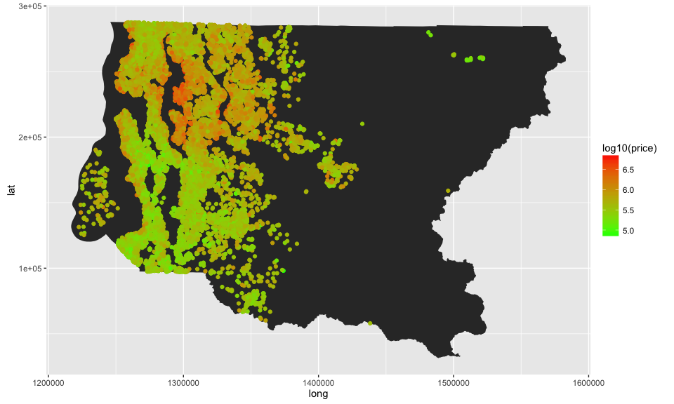
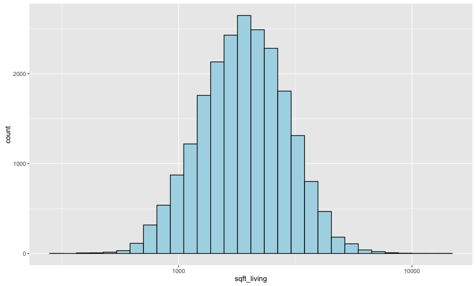
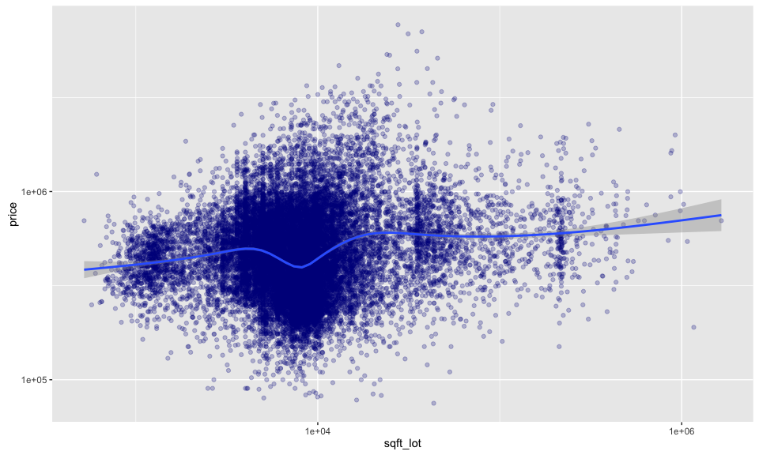
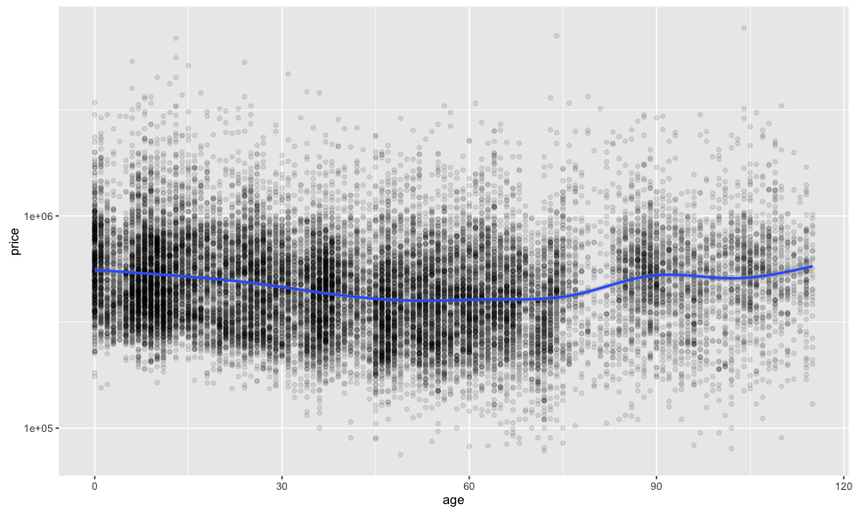

# Data Analysis P4
Jasper Alblas  
November 22, 2016  
Data Analysis P4 by Jasper Alblas
========================================================


# Introduction 

In this project, I will take a look at a dataset over house sales in King County, 
Washington in the U.S. The subject of this study will be to investigate which 
variables have an influence on house prices. This dataset includes 21 different 
variables based on house sales between May 2014 and May 2015. This dataset set 
can be found here: 
https://www.kaggle.com/harlfoxem/housesalesprediction

It includes 21613 observations, with 21 variables.


*The following variables are included:*

1. id
2. date: Date on which property was sold
3. price: Price for which property was sold
4. bedrooms Number of bedrooms
5. bathrooms: Number of bathrooms, can have decimal values as bathrooms without
  show count for 0.5
6. sqft_living: Living space in square feet
7. sqft_lot: Land space in square feet
8. floors: Number of floors 
9. waterfront:  A dummy variable for whether the apartment was overlooking the 
  waterfront or not 
10. view:  An index from 0 to 4 of how good the view of the property was 
11. condition: Relative to age and grade. Coded 1-5.
  1 = Poor- Worn out.
  2 = Fair- Badly worn.
  3 = Average
  4 = Good
  5= Very Good
12. grade: 	Classification by construction quality which refers to the types of 
      materials used and the quality of workmanship.
      Buildings of better quality (higher grade) cost more to build per unit of 
      measure and command higher value. Index from 1 to 13.
13. sqft_above: Living space above ground level in square feet
14. sqft_basement: Living space below ground level in square feet
15. yr_built: The year the house was built
16. yr_renovated: The year of the house's last renovation
17. zipcode: Zipcode of area 
18. sqft_living15: Average of house living space of nearest 15 neighbors in 
  square feet.
19. sqft_lot15: Average of lot space of nearest 15 neightbors in square feet.
20. x. X coordinate, will not be used in regression, just for showing on a map.
21. y. Y coordinate, same as above.


*Sources:* 
https://www.kaggle.com/harlfoxem/housesalesprediction
http://info.kingcounty.gov/assessor/esales/Glossary.aspx?type=r


Let's start by loading in the data.


## Map over houses

Before continueing with the analysis of this dataset, let's have a quick look 
at the location of the sold houses in King County. Let's plot all houses by 
their x and y value.

<!-- -->

To put things into perspective it would be useful to have a layer showing 
the county.I have downloaded a shape file at the following url: 
http://www5.kingcounty.gov/gisdataportal/
I will use the rgdal package to read in the data.

<!-- -->

When showing spatial information it is very important that all data has the same 
projection, otherwise the points will not show up together correctly. 
With the help of the following source I made sure that the points in 
the houses dataset are transformed to the right projection.

<!-- -->

This plot accurately shows the location of point on the king county map. 
Let's take a look at the average square meter price instead (log10).

<!-- -->


# Univariate Plots Section

### Price


Let's take a look at some of the most important variables in this dataset.
As we are trying to predict house prices, let's start with looking at the 
distribution of price.


```
##    Min. 1st Qu.  Median    Mean 3rd Qu.    Max. 
##   75000  322000  450000  540100  645000 7700000
```

<!-- -->

As can be seen, the distribution of prices is positively skewed. 
This is to be expected as there typically are not as many very expensive houses 
compared to houses in the median price range.

Due to the long tail caused by outliers, let's try converting the x-axis on the logarithmic scale.

<!-- -->

This plot gives a better overview over the data, as the tail is removed and 
the price distribution is now approximately normal distributed. 

###Living space


<!-- -->

For the same reasons previously mentioned, this plot can also be improved by 
taking the common log of the x-axis.

<!-- -->

Another way at looking at this would be the use of a relative frequency polygon.

<!-- -->

###Lot size


Now, let's plot lot size versus the common log of price.

<!-- -->


```
##    Min. 1st Qu.  Median    Mean 3rd Qu.    Max. 
##     520    5040    7618   15110   10690 1651000
```

There are some extreme outliers, so the plot would benefit from taking the 
natural log of the lot size.

<!-- -->
 
###Bedrooms


```
##    Min. 1st Qu.  Median    Mean 3rd Qu.    Max. 
##   0.000   3.000   3.000   3.371   4.000  33.000
```

<!-- -->

There is one extreme outlier in the dataset, but we cannot be sure if this is 
an error, or if a residence of this size actually exists. I will therefore 
not remove it.

###Bathrooms


```
##    Min. 1st Qu.  Median    Mean 3rd Qu.    Max. 
##   0.000   1.750   2.250   2.115   2.500   8.000
```

<!-- -->

###Waterfront

<!-- -->

A strong majority of the houses does not have a waterfront, with only 163 out
of 21613 houses.

###View


<!-- -->
 
Although it is unfortunately not completely known how the view variable 
was judged, it seems clear that a strong majority was rated to have a lowly 
ranked view, while the other categories are much less common.
 
###Condition


<!-- -->

Houses seem to be in quite a good condition on average, with more houses have 
a condition of 3 and higher.

###Grade


<!-- -->

###Age


Since the dataset includes the year the house was built, it is possible to 
calculate the data by substracting the selling year by the build year. 
This gives the age in years.


<!-- -->

###Renovation


As in the previous section, it is possible to calculate how many years ago the
house was renovated by substracting the selling year by the year of renovation. 
This gives the amount of years since the last renovation.


<!-- -->

# Univariate Analysis

### What is the structure of your dataset?


```
## 'data.frame':	21613 obs. of  25 variables:
##  $ id             : num  7.13e+09 6.41e+09 5.63e+09 2.49e+09 1.95e+09 ...
##  $ date           : Factor w/ 372 levels "20140502T000000",..: 165 221 291 221 284 11 57 252 340 306 ...
##  $ price          : num  221900 538000 180000 604000 510000 ...
##  $ bedrooms       : int  3 3 2 4 3 4 3 3 3 3 ...
##  $ bathrooms      : num  1 2.25 1 3 2 4.5 2.25 1.5 1 2.5 ...
##  $ sqft_living    : int  1180 2570 770 1960 1680 5420 1715 1060 1780 1890 ...
##  $ sqft_lot       : int  5650 7242 10000 5000 8080 101930 6819 9711 7470 6560 ...
##  $ floors         : Ord.factor w/ 6 levels "1"<"1.5"<"2"<..: 1 3 1 1 1 1 3 1 1 3 ...
##  $ waterfront     : Factor w/ 2 levels "0","1": 1 1 1 1 1 1 1 1 1 1 ...
##  $ view           : Ord.factor w/ 5 levels "0"<"1"<"2"<"3"<..: 1 1 1 1 1 1 1 1 1 1 ...
##  $ condition      : Ord.factor w/ 5 levels "1"<"2"<"3"<"4"<..: 3 3 3 5 3 3 3 3 3 3 ...
##  $ grade          : Ord.factor w/ 12 levels "1"<"3"<"4"<"5"<..: 6 6 5 6 7 10 6 6 6 6 ...
##  $ sqft_above     : int  1180 2170 770 1050 1680 3890 1715 1060 1050 1890 ...
##  $ sqft_basement  : int  0 400 0 910 0 1530 0 0 730 0 ...
##  $ yr_built       : int  1955 1951 1933 1965 1987 2001 1995 1963 1960 2003 ...
##  $ yr_renovated   : int  0 1991 0 0 0 0 0 0 0 0 ...
##  $ zipcode        : int  98178 98125 98028 98136 98074 98053 98003 98198 98146 98038 ...
##  $ sqft_living15  : int  1340 1690 2720 1360 1800 4760 2238 1650 1780 2390 ...
##  $ sqft_lot15     : int  5650 7639 8062 5000 7503 101930 6819 9711 8113 7570 ...
##  $ long           : num  1288597 1274754 1296031 1255063 1341588 ...
##  $ lat            : num  189725 266528 272295 193877 227342 ...
##  $ optional       : logi  TRUE TRUE TRUE TRUE TRUE TRUE ...
##  $ year_sold      : num  2014 2014 2015 2014 2015 ...
##  $ age            : num  59 63 82 49 28 13 19 52 55 12 ...
##  $ last_renovation: num  NA 23 NA NA NA NA NA NA NA NA ...
```

As mentioned in the introduction, there are 21613 observations with 21 variables.

### What is/are the main feature(s) of interest in your dataset?

The features we are most interested in are those that potentialy could influence 
the price of houses in King County. It is not hard to imagine that most variables 
in this dataset have some sort of relationship with price. Bigger houses will 
naturally sell for more, all other variables being equal. The same will likely 
be true for the newer houses, or houses in a better condition. In addition, it 
will be interesting to see if other physicial attributes on the houses have any 
influence on price, such as lot size, condition, renovation or age.

### What other features in the dataset do you think will help support your investigation into your feature(s) of interest?

It is likely that are a variety of environmental variables that also impact 
price. In this datset there are included variables to account for the quality of 
view, and whether the house has a waterfront or not. In addition there are two 
variables which measure the average living and lot space from the closest 15 
houses. This could also be seen as some kind of indication of the kind of 
neighborhood the house is in, although the potential effectis not that intuitive.

It is important to note though that there might be other variables like this 
that influence price, which are not accounted for. Examples like this might be 
the proximity to recreational areas, nature, or shopping centers. There could 
also be environmental variables that have a negative effect on price, such as 
the proximity to major roads. A more in depth spatial analysis using GIS might
be called for to further improve the model build later on in this study.

### Did you create any new variables from existing variables in the dataset?

First, I have converted the "year built" and "year renovated" variables. In the 
original dataset they appeared as the specific year the house was built/renovated, 
but for this analysis it was deemed more useful to convert the variables to the 
age of the house in total years, and the amount of years ago the renovation took 
place. This was done by substracting the sale year by the age the house was 
built or renovated.
Second, I created a dummy variable to see whether a house has any basement or not.
Third, I grouped the data in the month the house was sold to investigate any 
trends in relation to time.
Finally, I divided the dataset in 5 different age categories to use this for 
plotting later on.

### Of the features you investigated, were there any unusual distributions? Did you perform any operations on the data to tidy, adjust, or change the form of the data? If so, why did you do this?

There were a variety of variables which needed to be converted. Many 
distributions were positively skewed, since there are a smaller number of houses
which were extraordinary large (and thus expensive). This problem was solved by
taking the log10 of these, which in many cases made the distrubtion more similar
to a normal distribution.

# Bivariate Plots Section

To get a quick look at possible variables that are correlated to each other, 
we will use the GGally library to get a quick matrix plot of the relationships
between multiple columns.


<!-- -->

As can be seen, there are several variables which on first view seems to be 
correlated with price. Variables with correlation indexes of at least 0.5 are: 
bathrooms, sqft_living, grade, sqft_above, sqft_living15, and 
finally last_renovation.

### Living space versus price


<!-- -->

While this plot is reasonable, it could benefit from transforming the y axis 
since the scatter seems to increase with higher prices.

<!-- -->

These two variables have a correlation index of:

```
## [1] 0.7020351
```


###Lot size versus price


<!-- -->

It is difficult to see any form of strong relationship between price and lot 
size.

These two variables have a correlation index of:

```
## [1] 0.08966086
```

With a correlation index of 0.09 I have decided not to take this variable
along in any model.

###Bedrooms versus price


<!-- -->

The smooth line added to this plot seems to suggest that a higher number of
bedrooms leads to higher price. Note that there is likely also a correlation 
between bedrooms and size.

These two variables have a correlation index of:

```
## [1] 0.3083496
```

###Bedrooms versus size

<!-- -->

These two variables have a correlation index of:


```
## [1] 0.5766707
```

This is clearly the case, so we have to be careful when adding both variables 
to a linear model.

###Bathrooms versus price


<!-- -->
  
Another upward trend can be seen here, and with a correlation index of 0.53 
there seems to be a reasonable level of correlation between number of bathrooms 
and house price. Again, bathrooms are probably correlated with size as well.

<!-- -->

These two variables have a correlation index of:

```
## [1] 0.7546653
```

This is also the case here, so we again have to be careful when adding both 
variables to a linear model.

###Floors versus price


<!-- -->
  
The number of floors a house has, seems to have some kind of relationship with 
price. Floors with 1,5 floors and up seem to be more expansive on average than 
houses with only one floor. This effect seems to disappear with more floors 
though.

###Waterfront versus price


<!-- -->

The proximity to a body of water seems to have a positive effect on house 
prices, as the majority of houses with waterfront are higher than the majority 
of houses without.

###View


<!-- -->

As with waterfront, the quality of view seems to have a positive effect on house 
prices, with higher qualities of view associated with higher prices.

###Condition


<!-- -->

Houses in a greater condition seem to sell for more.

###Grade


<!-- -->

Houses that are graded more are clearly priced more than lower graded houses. 
This is not unexpected as the grade could be seen as a combined variable of 
several of the previous variables.

##Basement space

<!-- -->

These two variables have a correlation index of:

```
## [1] 0.323816
```

Basement size also seems to be positively correlated with price. 
But let's have a look at whether this effect also can be seen when compared 
houses with, and without, a basement.

###Basement or not


<!-- -->

###Ground level space


<!-- -->

These two variables have a correlation index of:

```
## [1] 0.6055673
```

As could be seen with living space, the living space above ground (exluding 
basement) is also strongly correlated with price.

###Age


<!-- -->

It's hard to see a correlation between these price and age. Let's try grouping 
houses into age groups.

<!-- -->

These two variables have a correlation index of:

```
## [1] -0.05395613
```

Nwer houses seem to be slightly higher priced than medium aged houses, with very 
old houses seeming to get more expansive again. This correlation is hard to see
when looking at the correlation index.

###Renovation


<!-- -->

Hard to make any conclusion, but it seems that recent renovations have a 
positive effect on price, while less recent renovations lead to lower price. 
This could be because the house is in a poor state.

These two variables have a correlation index of:

```
## [1] -0.128305
```

###Neighbor living space


<!-- -->

Houses in neighborhoods with large houses tend to be higher priced.

<!-- -->

These two variables have a correlation index of:

```
## [1] 0.5853789
```

Houses in neighborhoods in proximity to larger houses, tend to be large. 
This could explain the higher prices previously seen.

###Neighbor lot size


<!-- -->

These two variables have a correlation index of:

```
## [1] 0.08244715
```

No clear correlation here.

###Month/Year


It could be interesting to see if the month and year have any influence on 
price, e.g. to see if there is any part of the price that could be explained by 
trends in time, such as market changes. However, since the dataset covers little 
more than a year, it is unlikely to be clear.


<!-- -->

As could be seen, there is no general trend to be seen. There seem to be a 
downward trend in the first months of the dataset, which could be due to 
lower house prices in the winter months, but I am lacking further information 
to confirm this. 

# Bivariate Analysis

### Talk about some of the relationships you observed in this part of the investigation. How did the feature(s) of interest vary with other features in the dataset?

Most of the variables were to some extend correlated with price. Variables where 
this was not immediately clear from the plots are lot size, neighbour lot size, 
and the age of the house. The strongest relationship was found between living 
area and price. A suprise was found when plotting the month the house was sold 
against the price. There seemed to be a trend visible which indicates lower
house prices in the winter months. A quick search seems to indicate this is 
actually quite normal.

### Did you observe any interesting relationships between the other features (not the main feature(s) of interest)?

It is important to mention the issue of multicollinearity. In this study we will 
create a linear model with a variety of independant variables. It is likely 
however that several of these independant variables might be correlated with 
each other. Take for example the variable for living space and that for the 
number of bathrooms and bedrooms. It can be expected that larger houses will
also feature more bathrooms and bedrooms. This risk means that we have to be
careful to add those variables together in a model, as they might explain the
same kind of variation in house price.

### What was the strongest relationship you found?
The strongest relationship was found between living space and price. This is 
not surprising as a larger house will always sell for more than a smaller house,
all other features being equal. Surprisingly, the size of the whole lot did not 
seem to be clearly correlated with price.

# Multivariate Plots Section

##Living space, price and condition
<!-- -->

Houses in a better condition seem to be slightly higher priced, but the effect 
is minimal.

###Living space, price and view


<!-- -->

Houses with better views seem to have higher average prices.

###Living space, price and waterfront


<!-- -->

This plot clearly shows that prices are higher for houses with waterfront 
when comparing house of similar size.

###Living space, price and grade


<!-- -->

Higher graded houses also clearly seem to be more expensive.

###Living space above surface vs basement space


<!-- -->

Living space above surface (red) seems to be valued more than 
basement space (blue).

#Building a model

Now I will build a model with many of the variables analyzed before.


```
## 
## Call:
## lm(formula = I(log10(price)) ~ I(sqrt(sqft_living)) + waterfront + 
##     view + condition + age + bathrooms + floors + sqrt(sqft_basement) + 
##     sqft_living15 + grade + has_basement + last_renovation, data = houses)
## 
## Residuals:
##      Min       1Q   Median       3Q      Max 
## -0.44937 -0.08332  0.00589  0.08968  0.45711 
## 
## Coefficients:
##                        Estimate Std. Error t value Pr(>|t|)    
## (Intercept)           5.163e+00  6.276e-02  82.268  < 2e-16 ***
## I(sqrt(sqft_living))  6.078e-03  9.929e-04   6.121 1.39e-09 ***
## waterfront1           1.088e-01  3.105e-02   3.505 0.000480 ***
## view.L                2.567e-02  2.128e-02   1.206 0.228075    
## view.Q                1.270e-02  1.841e-02   0.690 0.490478    
## view.C                4.186e-02  2.049e-02   2.043 0.041327 *  
## view^4                7.480e-03  1.872e-02   0.399 0.689632    
## condition.L           1.082e-01  9.075e-02   1.192 0.233589    
## condition.Q           3.895e-02  7.694e-02   0.506 0.612830    
## condition.C          -1.696e-01  6.194e-02  -2.738 0.006312 ** 
## condition^4           1.255e-01  3.721e-02   3.372 0.000779 ***
## age                   1.614e-03  2.347e-04   6.880 1.14e-11 ***
## bathrooms             1.485e-02  8.564e-03   1.734 0.083255 .  
## floors.L             -2.766e-02  3.406e-02  -0.812 0.417073    
## floors.Q             -3.094e-03  2.792e-02  -0.111 0.911810    
## floors.C              2.386e-02  2.677e-02   0.891 0.373022    
## floors^4              2.236e-02  1.858e-02   1.203 0.229148    
## sqrt(sqft_basement)   5.521e-04  1.122e-03   0.492 0.622682    
## sqft_living15         8.922e-05  9.472e-06   9.420  < 2e-16 ***
## grade.L               4.892e-01  9.886e-02   4.948 8.98e-07 ***
## grade.Q               2.942e-02  8.514e-02   0.346 0.729784    
## grade.C              -1.911e-01  7.440e-02  -2.569 0.010354 *  
## grade^4               1.828e-01  6.746e-02   2.709 0.006876 ** 
## grade^5               3.455e-03  5.973e-02   0.058 0.953885    
## grade^6               9.041e-02  4.796e-02   1.885 0.059738 .  
## grade^7               2.579e-02  3.436e-02   0.751 0.453002    
## grade^8               1.382e-02  2.218e-02   0.623 0.533456    
## grade^9               3.203e-03  1.341e-02   0.239 0.811305    
## has_basement1         1.109e-02  2.991e-02   0.371 0.711011    
## last_renovation      -1.011e-03  3.546e-04  -2.852 0.004444 ** 
## ---
## Signif. codes:  0 '***' 0.001 '**' 0.01 '*' 0.05 '.' 0.1 ' ' 1
## 
## Residual standard error: 0.1337 on 884 degrees of freedom
##   (20699 observations deleted due to missingness)
## Multiple R-squared:  0.7638,	Adjusted R-squared:  0.7561 
## F-statistic: 98.59 on 29 and 884 DF,  p-value: < 2.2e-16
```

This model was built by first adding all variables, seeing which were 
significant or not. Variables which were not significant did then get removed
from the model. These were: sqft_above, lot size, and bedrooms. This is most
likely to do to the earlier mentioned multicollinearity, since these 3 removed
variables are likely also heavily correlated with total living space, a variable
which is included in the model. All in all, the model has a adjusted R-squared 
value of 0.7561, meaning that roughly 75% of price variation can be explained 
by the included variables.

# Multivariate Analysis

### Talk about some of the relationships you observed in this part of the investigation. Were there features that strengthened each other in terms of looking at your feature(s) of interest?

Yes, as discussed before, many of the independant variables were correlated 
with each other. Living space, lot size, above ground living space, basement 
space, living space and lot size of the closest 15 neighbors, number of 
bathrooms, and finally number of bedrooms, can all be seen as some form of
measure of the size of the house. We therefore had to be careful with including 
all these in the same linear model.

### Were there any interesting or surprising interactions between features?
Most interesting interactions are already discussed in the previous paragraph. 
All of the categorical variables seemed to have an clear correlation with price,
when keeping houses of the same size. This was the case for view, condition, 
grade, and waterfront.

### OPTIONAL: Did you create any models with your dataset? Discuss the strengths and limitations of your model.

Yes, see above. The strenghts of this model are that it explains 75% of the 
variation in price. This is quite high, and will likely not be able to get much
higher with this dataset. 

It is important to realize there are other factors that might influence house 
prices, that are not a part of this model. There is for example no real variable
to indicate the proximity to a large city (Seattle in this case). From personal
experience I know that the proximity to large urban centers can really impact 
house prices. In addition, there are indicators for the type of neighborhood
the house is in, except for the average house size of neighboors. Perhaps the 
neighborhood is in a poor state, there are problems with criminality, or there
are no good schools nearby? Finally, some physical factors regarding the house 
are not included. One important thing that comes to mind is how well isolated 
the house is.

Another previously mentioned potential problem is that some of the indepedant 
variables might be corrolated with each other. While some of these have been 
removed for exactly this reason, there could sitll be cases of this remaining 
in this model. Living space, number of bathrooms, and the number of floors comes
to mind.

# Final Plots and Summary

### Plot One
<!-- -->

### Description One
This boxplot shows the correlation between the view rating and price. It shows
that houses with a greater view have greater median prices than houses with no 
or a poor view.

### Plot Two
<!-- -->

### Description Two
This plot clearly shows that there is a correlation between living space and 
price. In addition, houses with higher grades also were sold for more on the 
market compared to houses with lower grades. 

### Plot Three
<!-- -->

### Description Three
The upper plot shows the average house price of houses sold per month over the 
datasets time period. The lower plot shows the same period, but shows the total 
houses sold per month. House prices and houses sold seem to be lower in winter 
months.

# Reflection

I am quite happy with the results of this project. A large number of variables 
were found to be more or less correlated with the house price.Some variables 
that were expected to be correlated with price, were as a matter of fact not 
correlated. An example of this was lot size. Other variables that I did not
expect to have an impact on price, were actually correlated with price. This was
true for the month the house was sold, although the relationship was not linear.
Finally, there were variables that had an opposite effect than was expected.
Increasing buildings age was actually found to have a positive effect on price, 
with the exception of recently build houses.

The model produced explains roughly 75% of the variation in house prices. 
This could definately be improved upon with more data. As I have previously 
mentioned there a variety of environmental variables, as well as some more 
characteristics of the house that are missing. Issues such as nearby schools,
road noise, criminality, or proximity to urban centers are not included and I
would expect these to improve the model if included.

Overall it has been an extremely learnful process, and a lot of thought has gone 
into the different kind of graphs that can best visualize a relationship.
Colors are very important here as well.
Challenges were in the decision which variables to include in the linear model.
As discussed, many dependant variables relate to each other, with the best
example of this all the different variables related to size. It is difficult to
judge whether to include all of these. Most variables were actually found to be 
significant in predicting prices, but each variable did not add much to the 
overall strenght of the model.
